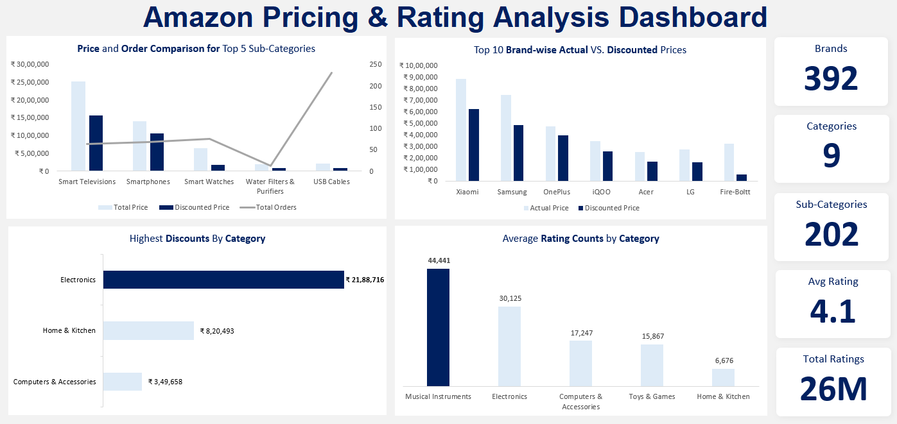

# Amazon Product Pricing & Rating Analysis Dashboard

## 1. Overview

This project analyzes Amazon product data to understand how **pricing, discounts, ratings, and order volume** vary across brands, categories, and sub-categories.

The final output is an **Excel dashboard** that helps compare actual prices, discounted prices, customer ratings, and product demand across different product groups.

## 2. Business Problem

Amazon marketplace sellers and category teams need to understand whether discounts are helping product performance and customer engagement. High discounts do not always mean high order volume, and strong customer ratings may appear in categories that are not the biggest revenue contributors.

This project helps answer business questions such as:

- Which categories receive the highest discounts?
- Which categories have the strongest customer rating engagement?
- Which sub-categories show high demand even with lower discounts?
- Which brands are using aggressive discounting?
- Are pricing patterns, such as charm pricing, linked with strong ratings?

## 3. Objective

- Analyze pricing and discount patterns across product categories and brands.
- Compare actual price and discounted price for top brands.
- Identify categories and sub-categories with strong ratings and order activity.
- Study whether low-discount products can still show high customer demand.
- Build a dashboard that supports pricing, marketing, and customer experience decisions.

## 4. Key Insights

- **Electronics** had the highest total discount among major categories, followed by **Home & Kitchen** and **Computers & Accessories**.
- **Musical Instruments** showed the highest average rating count, with **44,441 average ratings**, indicating strong customer engagement in that category.
- **USB Cables** recorded the highest number of orders among the top sub-categories, with **173 orders**, despite having relatively low discounts.
- **Smart Televisions** had a high discount value but only **63 orders**, suggesting that discounting alone may not be enough to drive order volume.
- **Xiaomi** showed a large discount gap between actual and discounted prices, positioning the brand competitively against other major brands.
- A large share of products used **charm pricing**, such as prices ending in `99`, and these products showed ratings above **4 out of 5** in the analysis.

## 5. Recommendations

- Review high-discount categories like **Smart Televisions** to understand why order volume is not increasing proportionally.
- Use high-demand products such as **USB Cables** for upselling, bundling, or cross-selling strategies.
- Study customer engagement in **Musical Instruments** to understand what is driving strong rating activity.
- Compare brand-level discounting for companies like **Xiaomi, Samsung, and OnePlus** to evaluate competitive pricing strategy.
- Avoid assuming that larger discounts always lead to stronger customer demand; combine discount analysis with orders and ratings.
- Continue monitoring charm pricing, but validate it with conversion and revenue data before treating it as a final pricing strategy.

## 6. Business Impact

This dashboard can help product, marketing, and customer experience teams make better pricing decisions. It shows where discounts are concentrated, which categories receive stronger customer engagement, and which products may have demand even without heavy discounting.

The analysis can support decisions around **pricing strategy, promotional planning, product bundling, brand positioning, and category-level performance review**.

## 7. Key Metrics

- **Brands analyzed:** 392
- **Categories analyzed:** 9
- **Sub-categories analyzed:** 202
- **Average rating:** 4.1
- **Total ratings:** 26M
- **Highest discount category:** Electronics
- **Highest average rating count category:** Musical Instruments
- **Highest-order sub-category mentioned:** USB Cables with 173 orders
- **High-discount sub-category mentioned:** Smart Televisions with 63 orders

## 8. Tools Used

- Microsoft Excel
- Power Query
- Pivot Tables
- Pivot Charts
- SUM and COUNT functions
- Sort and filters
- Slicers
- Tables
- Find and Replace
- Data cleaning functions
- Descriptive statistics
- Exploratory Data Analysis
- Dashboard formatting and visualization

## 9. Dataset

The dataset contains Amazon product information used for pricing, discount, rating, and category analysis.

Based on the analysis, the dataset included fields related to:

- Product name
- Brand
- Category
- Sub-category
- Actual price
- Discounted price
- Discount amount
- Rating
- Rating count
- Order count or product demand indicator

Only the dashboard and case study are included in this repository.

## 10. Process

- Reviewed the raw product dataset and identified the important fields for pricing and rating analysis.
- Cleaned inconsistent values using Excel tools and Power Query.
- Used Find and Replace, formatting, and data cleaning functions to prepare fields for analysis.
- Created calculated summaries for discounts, ratings, categories, brands, and order counts.
- Built Pivot Tables to compare category-level discounts, brand-level pricing, rating counts, and sub-category order activity.
- Used Pivot Charts and dashboard formatting to create a visual summary for business users.
- Interpreted the results to identify pricing and customer engagement patterns.

## 11. Dashboard / Output

The dashboard shows:

- Price and order comparison for top sub-categories
- Top brand-wise actual price vs discounted price
- Highest discounts by category
- Average rating counts by category
- Summary cards for brands, categories, sub-categories, average rating, and total ratings

## 12. What I Learned

- Cleaning and preparing e-commerce product data for analysis.
- Comparing actual price and discounted price across brands and categories.
- Using Pivot Tables and Pivot Charts to summarize pricing and rating trends.
- Interpreting discounts together with order volume and ratings instead of reviewing them separately.
- Building a business-focused Excel dashboard for pricing and customer experience analysis.

