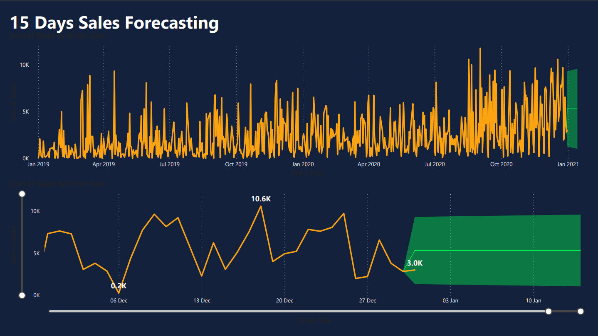
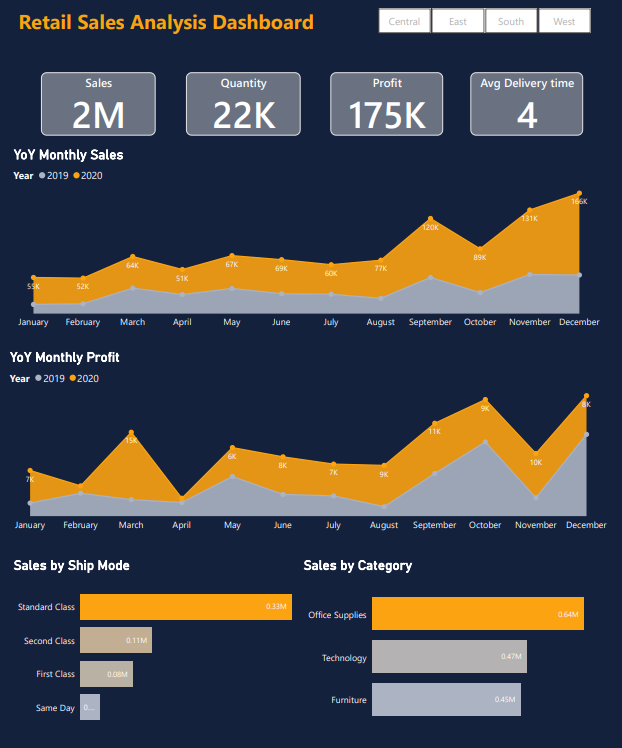

# Office Essentials Retail Sales Analysis Dashboard



## 1. Overview

Office Essentials Plus is an Indian retail store that provides office, personal, and furniture products with doorstep delivery.

This Power BI project analyzes sales, profit, orders, delivery performance, product categories, shipping modes, and short-term sales forecasting. The goal is to help marketing and business teams understand performance trends and make better decisions using data.

## 2. Business Problem

The retail store did not have a strong analytics strategy for using its sales, customer, delivery, and market data. Without a dashboard, business teams had limited visibility into what was driving sales, profit, category performance, and delivery efficiency.

The key business question was:

> How can Office Essentials Plus use its retail data to understand performance, identify trends, and support better business decisions?

## 3. Objective

- Build a Power BI dashboard to track sales, orders, profit, and delivery performance.
- Analyze year-over-year monthly sales and profit trends.
- Identify the strongest product categories and shipping modes.
- Create a short-term sales forecast for the first 15 days of January 2021.
- Present insights in a simple format for marketing and business stakeholders.

## 4. Dataset / Source

The project uses retail store sales data for portfolio analysis.

The dataset appears to include fields related to order date, sales, profit, quantity, product category, ship mode, region, delivery time, and forecasting time series.

## 5. Data Visualizations & Insights

### Sales Performance Dashboard


**Insight:** The store generated approximately **$2M in sales**, processed around **22K orders**, and earned about **$175K profit**. The average delivery time was approximately **4 days**.

**Insight:** The **Standard Class** shipping mode generated the highest sales at approximately **$0.33M**.

**Insight:** **Office Supplies** was the highest-selling category at approximately **$0.64M**, followed by **Technology** at approximately **$0.47M**.

---

### 15-Day Sales Forecast



**Insight:** For the first 15 days of January 2021, forecasted sales are projected to reach approximately **9,470**, with the lowest projected value around **1,156**.

**Insight:** The forecast view helps the business prepare for short-term demand, inventory planning, delivery capacity, and campaign timing.

## 6. Key Metrics

| Metric | Value |
|---|---:|
| Total Sales | ~$2M |
| Total Orders / Quantity | ~22K |
| Total Profit | ~$175K |
| Average Delivery Time | ~4 days |
| Peak 2020 Monthly Sales | ~165K |
| Peak 2020 Monthly Profit | ~8K |
| Highest Sales Ship Mode | Standard Class, ~$0.33M |
| Highest Sales Category | Office Supplies, ~$0.64M |
| Second Highest Category | Technology, ~$0.47M |
| 15-Day Forecasted Sales | ~9,470 |
| Lowest Forecasted Value | ~1,156 |

## 7. Key Findings

- The business generated strong sales volume, with approximately **$2M in sales** and **22K orders**.
- Profit reached approximately **$175K**, showing that the store was profitable during the analyzed period.
- Sales and profit gradually increased across months in the YoY trend, with stronger performance toward December.
- Sales dipped in October across both years, while profit peaked around that period.
- Standard Class shipping contributed the highest sales among ship modes.
- Office Supplies was the strongest product category by sales, followed by Technology.
- Average delivery time was approximately 4 days, giving the business a useful operational KPI to monitor.

## 8. Recommendations

- Monitor October sales dips to understand whether seasonality, demand changes, or campaign timing caused weaker performance.
- Focus marketing and inventory planning around high-performing months, especially the year-end sales period.
- Prioritize Office Supplies and Technology in promotional planning because they are the highest sales categories.
- Review Standard Class shipping performance to understand why it contributes the most sales.
- Use short-term forecasting to plan stock availability, campaign timing, and delivery capacity.
- Track average delivery time regularly to protect customer experience as order volume grows.

## 9. Business Impact

This dashboard gives marketing and business teams a single view of retail performance. Instead of manually reviewing sales records, stakeholders can quickly understand sales trends, profit movement, shipping performance, category contribution, and forecasted demand.

The analysis can support decisions around **marketing campaigns, inventory planning, delivery operations, product category focus, and short-term sales planning**.

## 10. Analysis Process

- Cleaned and transformed the raw retail sales data.
- Built relationships and data models in Power BI.
- Created DAX measures for KPIs such as sales, profit, orders, and delivery time.
- Designed visual dashboards with slicers for interactive analysis.
- Compared year-over-year monthly sales and profit trends.
- Analyzed sales by ship mode and product category.
- Built a short-term sales forecasting view.
- Converted dashboard findings into business insights and recommendations.

## 11. Skills Demonstrated

- Power BI dashboarding
- DAX measures
- Power Query
- ETL
- Data modeling
- Data transformation
- Data cleaning
- Slicers and custom visuals
- Conditional formatting
- Time-series forecasting
- Business insight writing
- Stakeholder-focused reporting

## 12. Files To Add

| File | Purpose |
|---|---|
| `assets/01_retail_sales_dashboard.png` | Main Power BI dashboard screenshot |
| `assets/02_15_days_sales_forecast.png` | 15-day sales forecasting dashboard screenshot |
| `files/office-essentials-retail-sales-dashboard.pbix` | Optional Power BI file |
| `data/sample-retail-sales-data.csv` | Optional sample dataset if data can be shared |

## 13. Repository Structure

```text
Office-Essentials-Retail-Sales-Analysis/
|-- README.md
|-- assets/
|   |-- 01_retail_sales_dashboard.png
|   |-- 02_15_days_sales_forecast.png
|-- files/
|   |-- office-essentials-retail-sales-dashboard.pbix
|-- data/
|   |-- sample-retail-sales-data.csv
```
